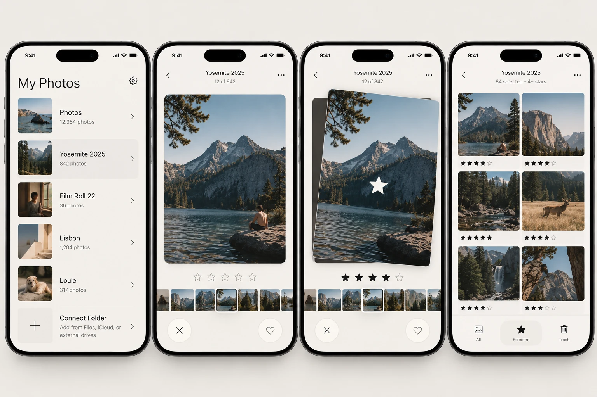

<div align="center">


# Pickory

**Rate and select your photos by swiping.**

Connect an album, then swipe: right for +1 star, left to move on unchanged, up to pick
(5 stars), down to reject. Star ratings are saved to your Photos library.
Pickory **never deletes photos**, and everything stays on your device.

[](#requirements)
[](https://developer.apple.com/xcode/swiftui/)
[](LICENSE)

</div>

---

## Overview

Back from a trip with 800 photos and need the best 80? Pickory turns
choosing into a quick swipe session. Connect an album, rate each photo with a
flick, then review your picks in a grid filtered by rating.

> No account. No servers. No tracking. Nothing is ever deleted.



<sub>Design mockup. The shipped app follows this layout.</sub>

## Features

### My Photos
- Connect the albums you want to work on. Only albums you created in Apple Photos
  are offered: never your whole library, Recents, or smart albums.
- Connected albums are remembered between launches. Swipe a row to disconnect
  it, which never touches the photos.
- Dropbox is listed as a source and marked **Coming soon**.

### Swipe to rate
- One large photo card, a tappable 5-star row, and a filmstrip to jump to any photo.
- A large overlay on the card shows what a swipe will do before you let go.
- **Undo** reverts the last decision exactly, including the previous rating.
- Reopening an album resumes where you left off.

### Review grid
- **All**, **Selected** and **Rejected** tabs, with each photo's stars underneath.
- Filter by minimum rating (0+ through 5) in both the swipe and grid views. The
  filter is always your choice and never applied automatically.
- Sort the grid by album order or by rating, highest or lowest first.
- Restore rejected photos from the Rejected tab.

## Gesture cheat-sheet

| Gesture | Action |
|---|---|
| Swipe **right** | +1 star (max 5) |
| Swipe **left** | Next photo, rating unchanged |
| Swipe **up** | Pick: set to 5 stars |
| Swipe **down** | Reject: set to 0 stars and hide in Pickory (never deleted) |
| Tap a **star** | Set an exact rating (stays on the photo) |
| Tap a **filmstrip** thumbnail | Jump to that photo |
| **Undo** | Revert the last decision |

Each swipe applies to the current photo and moves to the next.

## Privacy

Pickory is fully **offline**. It reads only the albums you connect and writes
only star ratings, using Apple's PhotoKit rating API (`PHAssetChangeRequest.rating`),
so ratings also show in the Photos app. Connected albums and rejected status are
stored locally with SwiftData. There is no networking code, analytics, or account.

## Requirements

- **iPhone** running **iOS 27.0** or later (the star-rating API is iOS 27+)
- A **Mac** with **Xcode 27** or later (to build & install)
- An **Apple ID** (a free one works; see the 7-day note below)

---

## Installation & Setup (build it yourself)

There is no App Store build yet — you install it from source with Xcode. A
**free Apple ID** is enough. Takes ~10 minutes the first time.

### 1. Clone the repo

```bash
git clone https://github.com/martimgs/photoswipe-ios.git
cd photoswipe-ios
```

### 2. Open the project

```bash
open Pickory/Pickory.xcodeproj
```

(or open `Pickory/Pickory.xcodeproj` from Xcode → File → Open.)

### 3. Set up signing (free Apple ID)

1. In Xcode's left sidebar, select the **Pickory** project, then the
   **Pickory** target.
2. Open the **Signing & Capabilities** tab.
3. Tick **Automatically manage signing**.
4. **Team →** *Add an Account…* → sign in with your Apple ID → pick your
   *(Personal Team)*.
5. Change the **Bundle Identifier** to something unique to you, e.g.
   `com.yourname.Pickory` (the default may already be taken).

### 4. Enable Developer Mode on your iPhone

iOS blocks running self-built apps until Developer Mode is on:

- **Settings → Privacy & Security → Developer Mode → On**
- The phone restarts; after reboot tap **Turn On** and enter your passcode.

> *(Developer Mode only appears in Settings after a Mac has connected to the phone at least once.)*

### 5. Connect and run

1. Plug your iPhone into the Mac. On the phone, tap **Trust This Computer** and enter your passcode.
2. In Xcode's top toolbar, set the run destination to **your iPhone** (not a simulator).
3. Press **the Run button** (or `Cmd + R`).

### 6. Trust the developer profile

The first launch is blocked by iOS. On the phone:

- **Settings → General → VPN & Device Management → [your Apple ID] → Trust**

Reopen **Pickory** from the home screen and grant **Full Access** to your
photo library when prompted (with limited access, albums may be missing and ratings may not save).

### The 7-day note (free accounts)

Apps signed with a **free** Apple ID expire after **7 days** — the icon stays,
but it won't launch. Just reconnect and press **the Run button** in Xcode again to refresh
for another 7 days. A paid **Apple Developer Program** account ($99/yr) extends
this to a year and removes the limit.

> Tip: in Xcode → *Window → Devices & Simulators → your iPhone →* enable
> **Connect via network** so you can re-sign over Wi-Fi without a cable.

### Run in the Simulator (optional)

You can also run it on the iOS Simulator (no device or signing needed). The
Simulator's library is nearly empty and has no albums: add photos by dragging
images onto the Simulator window (or with the command below), then create an
album in the Simulator's Photos app so there is something to connect.

```bash
xcrun simctl addmedia booted /path/to/photo.jpg
```

---

## Troubleshooting

| Symptom | Fix |
|---|---|
| **"Developer Mode disabled"** when running | Enable it: Settings → Privacy & Security → Developer Mode → On, then reboot. |
| **"Communication with Apple failed / no devices"** in Signing | Connect your iPhone first, then press the Run button. The profile is generated on first run. |
| App won't open after a few days | Free-account signing expired (7 days). Reconnect and run from Xcode again. |
| **"Untrusted Developer"** on launch | Settings → General → VPN & Device Management → trust your Apple ID. |
| Simulator build fails: *"No simulator runtime version available"* | Install a matching iOS runtime in Xcode → Settings → Components, or build to a real device. |
| "No albums found" when connecting | Pickory only lists albums you created. Make one in the Photos app first. |
| An album shows **Unavailable** | The album was deleted in Photos. Swipe the row to disconnect it. |
| Ratings don't stick | You probably granted *Limited* access. Re-grant **Full Access** in Settings → Privacy → Photos → Pickory. |

---

## Architecture

Pickory is a single-target SwiftUI app using **MVVM** over **PhotoKit**, with
**SwiftData** for app-local state.

```
Pickory/
├─ PickoryApp.swift            # App entry + SwiftData container
├─ Models/
│  ├─ PhotoLibraryService.swift   # PhotoKit: albums, photos, images, rating writes (no deletion)
│  ├─ ConnectedAlbum.swift        # SwiftData: connected album + resume position
│  ├─ PhotoState.swift            # SwiftData: per-photo rejected flag, keyed by (source, id)
│  ├─ PhotoSourceKind.swift       # Apple Photos / Dropbox (planned)
│  └─ SwipeAction.swift           # Decisions (rate / reject) with undo data
├─ ViewModels/
│  └─ AlbumSessionViewModel.swift # One album: deck, filter, ratings, rejects, undo
├─ Views/
│  ├─ RootView.swift              # Photo-access gate
│  ├─ LibraryView.swift           # "My Photos": connected albums
│  ├─ ConnectAlbumSheet.swift     # Source + album picker
│  ├─ SettingsView.swift          # Photo access, version
│  ├─ AlbumScreen.swift           # Hosts swipe + grid for one album
│  ├─ SwipeDeckView.swift         # Rating screen: card, gestures, buttons
│  ├─ PhotoCardView.swift         # Card + drag overlay
│  ├─ StarRatingView.swift        # 5-star row + filter labels
│  ├─ FilmstripView.swift         # Tap-to-jump thumbnails
│  ├─ RatingGridView.swift        # All / Selected / Rejected grid
│  └─ Thumbnail.swift             # Async thumbnail
└─ Support/
   └─ Theme.swift                 # Palette, motion, haptics
```

### Tech stack
SwiftUI · PhotoKit · SwiftData · Swift Concurrency · MVVM. No third-party dependencies.

## Roadmap

- [ ] Dropbox albums (folders)
- [ ] Export selected photos
- [ ] Video support

## Contributing

1. Fork the repo and create a branch: `git checkout -b feature/my-thing`
2. Keep the style: SwiftUI + MVVM, no third-party deps, on-device only, and **no deletion**.
3. Build clean (no warnings) against iOS 27+.
4. Open a PR with a clear description and a screenshot or GIF for UI changes.

## License

[MIT](LICENSE) © 2026 Alperen Adatepe

This is a fork of [noluyorAbi/photoswipe-ios](https://github.com/noluyorAbi/photoswipe-ios),
reworked from a photo-cleanup app into a rating and selection app.

## Acknowledgements

- Built with Apple's **PhotoKit**, **SwiftUI** and **SwiftData**.
